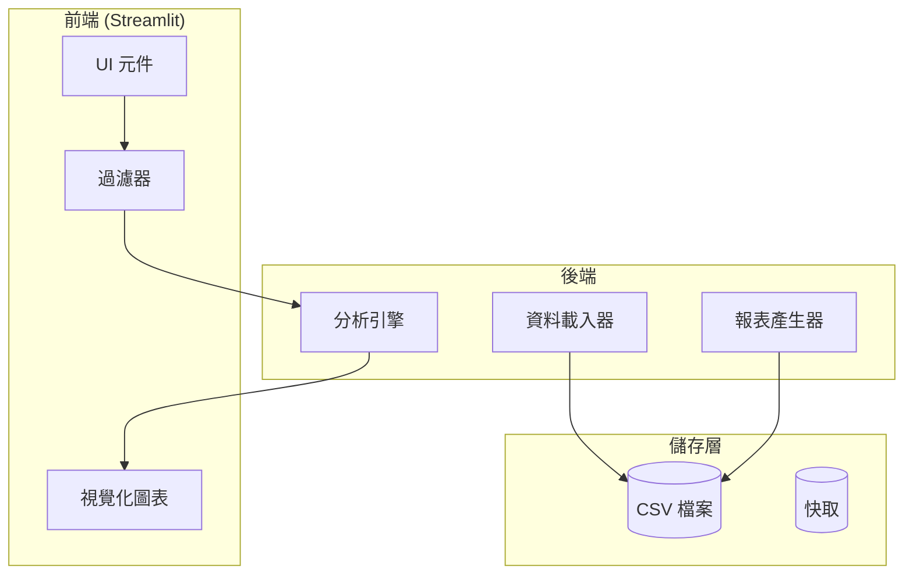
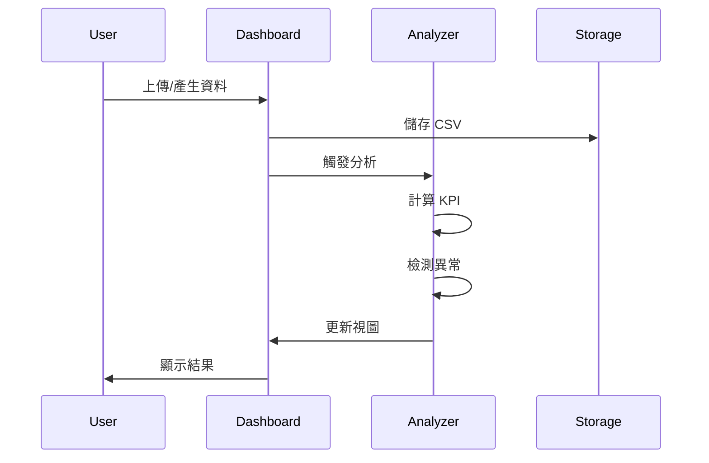
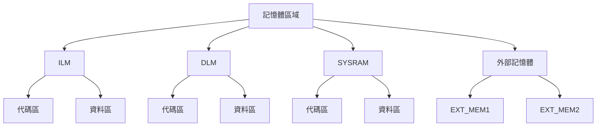
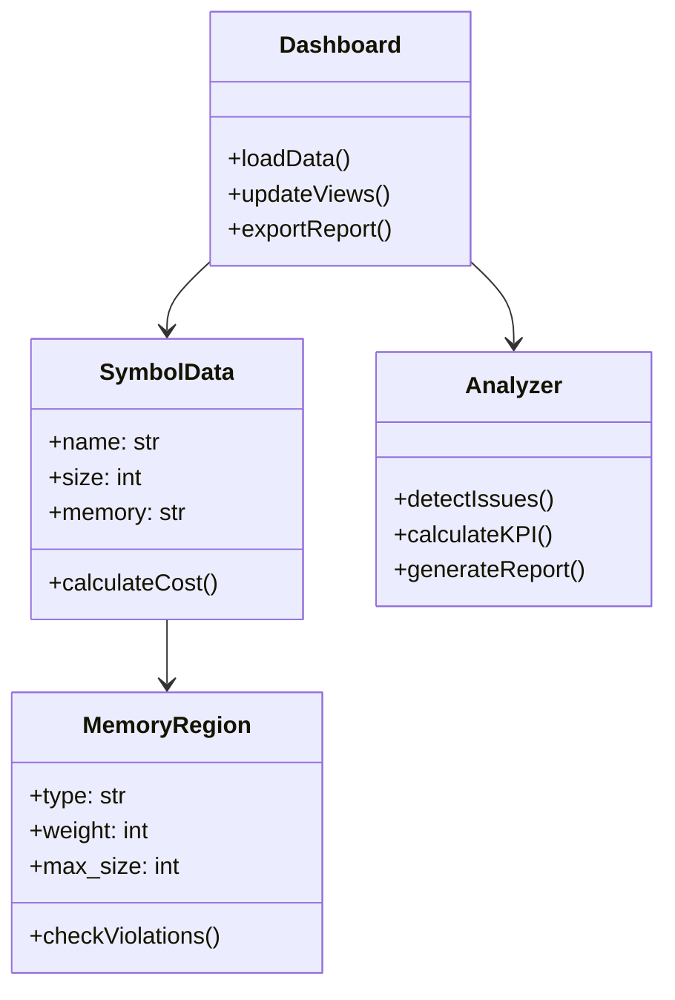
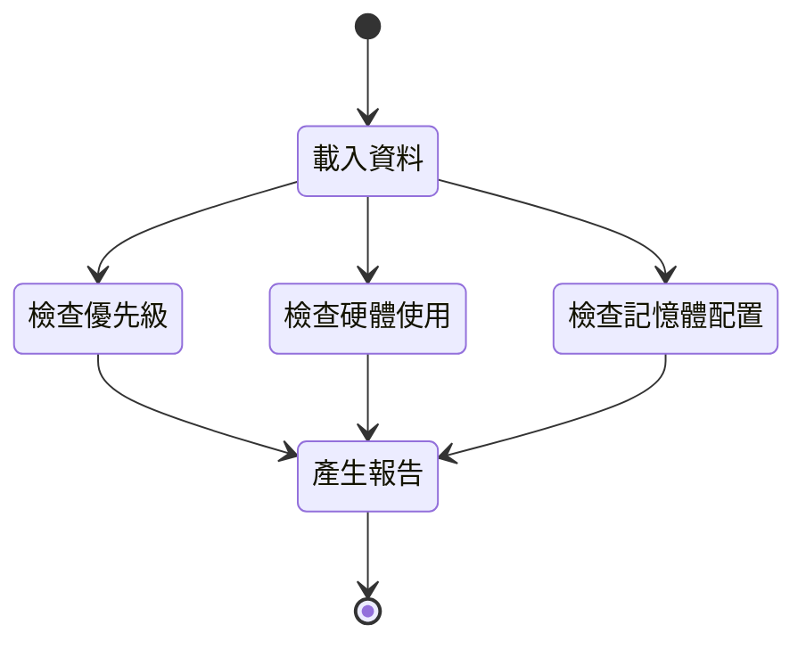
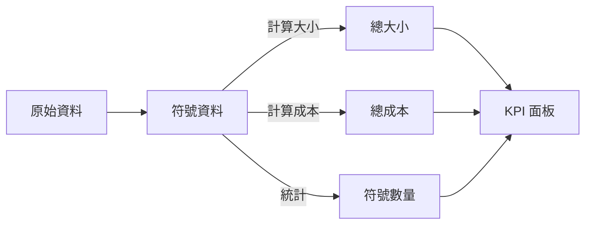

# Symbol Memory Dashboard 系統設計

## 系統架構總覽

目前實作的功能模組：
1. 全域篩選器
   - 記憶體區域
   - 模組
   - 資料夾
   - 檔案
   - Section
   - 即時性需求
   - 硬體使用

2. 分析頁面
   - 成本分析（Tab 1）
   - 記憶體分布（Tab 2）
   - 異常分析（Tab 3）
   - 詳細資料（Tab 4）

3. 異常檢測規則
   - High Realtime in ext_memory
   - Low Realtime in high-cost memory
   - Hardware usage in ext_memory
   - Realtime vs Access Count 不一致

系統採用三層式架構，分別為前端展示層、後端分析層和資料儲存層。主要考量：
- 資料處理與視覺化解耦
- 便於擴充新的分析規則
- 資料快取提升效能

## 前端元件職責
1. **UI 元件**
   - KPI 儀表板：展示關鍵績效指標
   - 資料過濾器：提供多維度篩選
   - 互動控制項：資料重新整理、報表輸出
   
2. **視覺化圖表**
   - TreeMap：展示記憶體配置層級關係
   - 熱力圖：顯示異常分布情況
   - 柱狀圖：模組成本排名
   - 圓餅圖：記憶體區域使用比例

## 後端處理流程

## 記憶體配置架構
記憶體區域依速度和成本分為四個主要層級：
- ILM/DLM：最高速，用於關鍵代碼和資料
- SYSRAM：系統 RAM，中等速度
- EXT_MEM：外部記憶體，最大容量但速度較慢

## 資料模型設計

### 核心類別職責
1. **SymbolData**
   - 符號基本資訊管理
   - 成本計算邏輯
   - 異常檢測協助

2. **MemoryRegion**
   - 記憶體區域特性定義
   - 容量限制檢查
   - 使用效率分析

3. **Analyzer**
   - 異常規則引擎
   - KPI 指標計算
   - 效能分析邏輯

4. **Dashboard**
   - 資料載入與更新
   - 視圖管理
   - 報表產生

## 異常檢測機制
系統支援多項自動化檢測：
1. 優先級檢查
   - High RT 符號在外部記憶體
   - Low RT 符號在高速記憶體
2. 硬體存取檢查
   - 硬體相關符號在外部記憶體
3. 容量檢查
   - 記憶體區域超載
   - 模組大小異常

## KPI 指標體系
關鍵績效指標分析：
1. 總體指標
   - 符號總數與分布
   - 記憶體使用效率
   - 異常情況統計
2. 區域指標
   - 各記憶體區域使用率
   - 模組成本分布
   - 優先級配置比例

## 實作重點與限制
1. 記憶體權重配置
   - 透過配置檔案設定
   - 支援動態調整
   - 預設值管理

2. 分析規則擴充
   - 規則引擎模組化
   - 自定義規則介面
   - 規則優先級管理

3. 效能考量
   - 資料快取策略
   - 增量更新機制
   - 分批處理大型資料

4. 報表標準化
   - CSV 格式規範
   - Markdown 模板設計
   - 圖表匯出格式